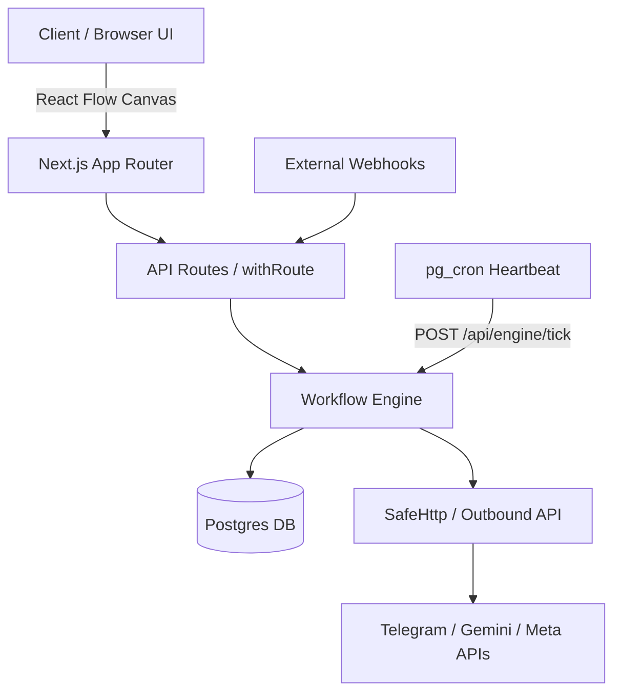

# BITO — Visual Workflow Automation Platform

BITO is a production-grade, serverless-friendly visual workflow-automation platform (an n8n alternative) built with Next.js App Router, React 19, TypeScript, and PostgreSQL (Supabase).

## Architecture



### Layer Boundaries

- `packages/shared`: Core types, BitoError, logger, redaction utilities (no external dependencies).
- `packages/engine`: Pure workflow engine logic, graph validation, expression evaluation, scheduler math (depends only on shared).
- `packages/integrations`: Typed API clients for third-party providers (depends only on shared).
- `packages/nodes`: Node definitions and registry (depends on shared, engine types, and integrations).
- `apps/web`: Next.js web application and API endpoints (may depend on all packages).

## Environment Variables

| Variable                    | Required                        | Description                                                                             |
| --------------------------- | ------------------------------- | --------------------------------------------------------------------------------------- |
| `DATABASE_URL`              | Yes                             | Supabase transaction pooler URL (port 6543)                                             |
| `DATABASE_URL_MIGRATE`      | For migrations                  | Direct Postgres connection URL (port 5432)                                              |
| `APP_URL`                   | Yes                             | Public application base URL (e.g. `http://localhost:3000` or `https://bito.vercel.app`) |
| `CREDENTIAL_ENCRYPTION_KEY` | Yes                             | Base64-encoded 32-byte key for AES-256-GCM credentials encryption                       |
| `CRON_SECRET`               | Yes                             | Secret token guarding the `/api/engine/tick` heartbeat endpoint                         |
| `WEBAUTHN_RP_ID`            | Yes                             | Domain name for WebAuthn passkeys (e.g. `localhost`)                                    |
| `WEBAUTHN_RP_NAME`          | Yes                             | Human-readable app name for WebAuthn (e.g. `BITO`)                                      |
| `WEBAUTHN_ORIGIN`           | Yes                             | Origin for WebAuthn verification (e.g. `http://localhost:3000`)                         |
| `SUPABASE_URL`              | Yes (Files)                     | Supabase project URL for private file storage                                           |
| `SUPABASE_SERVICE_ROLE_KEY` | Yes (Files)                     | Supabase service-role key for backend storage access                                    |
| `ALLOW_REGISTRATION`        | No (default `true`)             | Allow user registrations                                                                |
| `GEMINI_DEFAULT_MODEL`      | No (default `gemini-2.5-flash`) | Default Gemini model identifier                                                         |
| `GEMINI_PLATFORM_API_KEY`   | No                              | Optional platform fallback Gemini API key                                               |
| `GRAPH_API_VERSION`         | No (default `v20.0`)            | Meta Graph API version                                                                  |
| `TICK_BUDGET_MS`            | No (default `45000`)            | Maximum duration for a single tick execution cycle                                      |
| `ALLOW_PRIVATE_HTTP`        | No (default `false`)            | Permit private network HTTP calls (dev only)                                            |
| `NEXT_PUBLIC_APP_NAME`      | No (default `BITO`)             | The only allowed public env variable                                                    |

## Local Development

1. Install dependencies:

   ```bash
   pnpm install
   ```

2. Copy `.env.example` to `.env` and fill in required values:

   ```bash
   cp .env.example .env
   ```

3. Generate credential encryption key:

   ```bash
   pnpm gen:key
   ```

4. Run migrations:

   ```bash
   pnpm db:migrate
   ```

5. Start the development server:
   ```bash
   pnpm --filter @bito/web dev
   ```

## Deployment (Vercel + Supabase)

1. **Supabase**:
   - Create a project in Supabase.
   - Note down the direct DB URL (port 5432) for `DATABASE_URL_MIGRATE` and pooler URL (port 6543) for `DATABASE_URL`.
   - Create a private Storage bucket named `bito-files`.
   - Run `pnpm db:migrate` using `DATABASE_URL_MIGRATE`.
   - Enable `pg_cron` and `pg_net` extensions, and schedule the tick heartbeat (see Section 19 of SPEC).

2. **Vercel**:
   - Connect the repository with root directory `apps/web`.
   - Configure all environment variables listed above.
   - Deploy.

## How to Add a Node

1. Create a folder `packages/nodes/src/<category>/<node-name>/index.ts`.
2. Define and export `NodeDefinition` with:
   - Unique dotted `type` (e.g. `mycategory.action`)
   - `configSchema` (zod schema)
   - `fields` (UI form declaration)
   - `execute` handler
3. Register the node in `packages/nodes/src/registry.ts`.
4. Add unit test `index.test.ts` alongside the node file.
5. No changes to engine or UI code are needed.

## Troubleshooting

- **Webhook not firing**: Check `webhook_endpoints` table to ensure endpoint is active. Check server logs for signature mismatch or rate limiting (429).
- **Tick not running**: Verify that `CRON_SECRET` matches between Supabase `pg_cron` / Vercel Cron and your environment, and check `/api/engine/tick` logs.
- **Passkey RP ID mismatch**: Ensure `WEBAUTHN_RP_ID` matches the exact domain (no port, no protocol, e.g. `localhost` or `bito.vercel.app`) and `WEBAUTHN_ORIGIN` matches the full URL.
- **Credentials key errors**: Ensure `CREDENTIAL_ENCRYPTION_KEY` is exactly 32 bytes encoded in base64 (44 characters). Test with `pnpm gen:key`.
